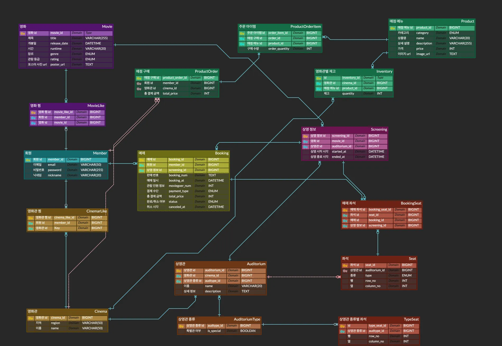

# spring-cgv-22nd
CEOS 22기 백엔드 스터디 - CGV 클론 코딩 프로젝트

## ERD

### 1. MovieLike, CinemaLike
각 테이블마다 복합키로 `(member_id, movie_id)`, `(member_id, cinema_id)`를 PK를 잡게 해서 중복으로 찜을 하는 상황을 대비한다.

### 2. AuditoriumType
- 상영관의 세부 종류 (2D, IMAX 등)는 AuditoriumType으로 관리
- 일반관과 특별관의 구분은 is_special로 한다.

### 3. TypeSeat
- 같은 타입의 상영관이면 동일한 좌석 배치를 갖도록 분리한다.

### 4. Auditorium
- 해당 타입의 TypeSeat를 복제해 여러 개의 Seat를 생성한다.

### 5. Seat
- 좌석 타입 (일반석, 장애인석)을 분리한다.

### 6. BookingSeat
- `(screening_id, seat_id)`로 unique key 제약을 걸어, 데이터베이스 레벨에서 중복 예매 (한 회차에 같은 좌석을 여러 번 예매)를 차단하게 했다.

### 7. Product, Inventory
- 전 지점에서 메뉴는 같으나 재고는 지점별로 다를 수 있음을 고려했다.

### 8. ProductOrderItem 
- 주문 라인에서 수량 체크를 위해 분리했다.
- 분리한 이유는 하나의 주문(ProductOrder)에서 여러 품목(Product)을 담을 수 있게 했다.
- 또한 회원, 지점과 같은 주문 단위의 속성과 수량(품목) 같은 속성을 분리해 정규화를 하기 위해 별도로 테이블을 설계했다.

[ 추가 내용 및 느낀점 ]
- TypeSeat를 하나의 템플릿처럼 사용하여 같은 타입의 상영관에서 반드시 동일하게 배치가 진행되게 하기 위해 별도 테이블을 설계하였다.
- 또한 일반석과 장애인석 등의 좌석별 속성을 지정하기 위해 Seat를 통해 유연한 확장을 하게 했다.

- 설계하면서 어디까지 정규화를 하는 게 맞고 어느 정도까지 성능을 고려해야 하는지 아직도 너무 헷갈린다. 공부 더 열심히 해야겠다..

# Spring Security + JWT

- 로그인 (인증) : 로그인 요청을 받은 후 세션 방식은 서버 세션이 유저 정보를 저장하지만 JWT 방식은 토큰을 생성하여 응답한다.
- 경로 접근 (인가) : JWT Filter를 통해 요청의 헤더에서 JWT를 찾아 검증을하고 일시적 요청에 대한 Session을 생성한다. (생성된 세션은 요청이 끝나면 소멸된다)

## SecurityConfig 클래스
- 세션 기반 로그인 방식을 모두 disable 해줘야 한다.
- JWT를 통한 인증/인가를 위해서 세션을 stateless 상태로 설정하는 것이 중요하다.
- 또한 비밀번호를 암호화하여 저장하기 위해서 BCryptPaasswordEncoder를 등록해준다.

## 스프링 시큐리티 필터 동작 원리
- 스프링 시큐리티는 클라이언트의 요청이 여러개의 필터를 거쳐 DispatcherServlet(Controller)으로 향하는 중간 필터에서 요청을 가로챈 후 검증(인증/인가)을 진행한다.

### 클라이언트 요청 → 서블릿 필터 → 서블릿 (컨트롤러)
(이미지)

### Delegating Filter Proxy
- 서블릿 컨테이너 (톰캣)에 존재하는 필터 체인에 DelegatingFilter를 등록한 뒤 모든 요청을 가로챈다.

- 서블릿 필터 체인의 DelegatingFilter → Security 필터 체인 (내부 처리 후) → 서블릿 필터 체인의 DelegatingFilter 
- 가로챈 요청은 SecurityFilterChain에서 처리 후 상황에 따른 거부, 리디렉션, 서블릿으로 요청 전달을 진행한다.

## JWT 생성 원리
JWT는 서버와 클라이언트 간에 정보를 안전하게 주고받을 수 있는 토큰 기반 인증 시스템. 이 토큰은 사용자 인증 정보와 기타 클레임(claim)을 포함하고 있으며, 서명되어 있어 위조가 불가능하다.

JWT는 Header.Payload.Signature 구조로 이루어져 있다. 각 요소는

- Header
    - JWT임을 명시
    - 사용된 암호화 알고리즘

- Payload
    - 정보

- Signature
    - 암호화알고리즘((BASE64(Header))+(BASE64(Payload)) + 암호화키)

기능들을 수행한다. JWT의 특징은 내부 정보를 단순 BASE64 방식으로 인코딩하기 때문에 외부에서 쉽게 디코딩 할 수 있다.  외부에서 열람해도 되는 정보를 담아야하며, 토큰 자체의 발급을 확인하기 위해서 사용한다.

https://www.jwt.io/